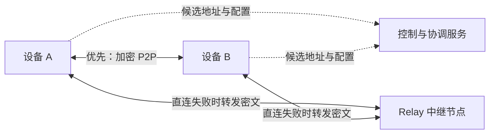
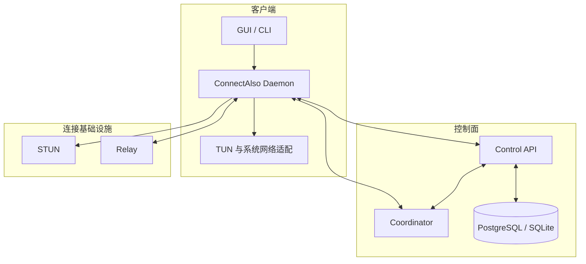

<div align="center">

# ConnectAlso

**简单、安全、可自托管的跨平台异地组网工具**

让分布在不同地点、不同网络环境中的设备，像处于同一个局域网中一样互联。

[](LICENSE)


[项目介绍](#项目介绍) · [核心特性](#核心特性) · [架构设计](#架构设计) · [路线图](#路线图) · [参与贡献](#参与贡献)

</div>

> [!IMPORTANT]
> ConnectAlso 目前处于早期规划和技术验证阶段，尚未发布可用于生产环境的版本。README 中的功能与接口描述代表项目目标，实际实现可能随着技术验证而调整。

## 项目介绍

ConnectAlso 是一个计划使用 **Rust** 构建的跨平台虚拟局域网工具，目标是在 Windows、macOS、Linux、iOS 和 Android 设备之间提供低门槛的安全互联能力。

用户无需理解端口映射、NAT、路由表或隧道配置，只需安装客户端并加入同一虚拟网络，ConnectAlso 即可自动完成设备认证、虚拟地址分配、P2P 打洞、加密通信和中继降级。

项目优先面向以下场景：

- 从外部网络安全访问家中的 NAS、服务器或开发设备；
- 连接跨地区的电脑、云主机、树莓派和 HomeLab；
- 为小型团队建立无需暴露公网端口的内部网络；
- 为远程桌面、开发测试和多人联机提供虚拟局域网；
- 使用自建控制服务和中继节点管理自己的网络基础设施。

## 设计目标

- **一键组网**：安装、加入网络、开始连接，尽量隐藏复杂网络概念。
- **P2P 优先**：优先建立设备间的点对点连接，降低延迟和中继成本。
- **自动降级**：P2P 无法建立时自动切换到加密中继通道。
- **端到端加密**：中继节点只转发密文，不应具备解密业务流量的能力。
- **支持自托管**：控制服务、协调服务和中继服务均计划支持自行部署。
- **跨平台核心复用**：使用 Rust 共享网络协议、状态机、加密和诊断逻辑。
- **安全默认值**：设备密钥在本地生成，敏感操作遵循最小权限原则。
- **可观测和可诊断**：清晰展示直连/中继状态、延迟、最近握手和失败原因。

## 核心特性

### 计划中的 MVP

- [ ] Windows、macOS 和 Linux 桌面客户端；
- [ ] iOS 和 Android 基础组网能力；
- [ ] 创建、加入和退出虚拟网络；
- [ ] 基于 TUN 的三层虚拟网络；
- [ ] 虚拟 IPv4 地址自动分配；
- [ ] UDP NAT 探测和 P2P 打洞；
- [ ] P2P 失败后的流量中继；
- [ ] 默认端到端加密；
- [ ] 设备注册、审批、撤销和密钥轮换；
- [ ] 自建控制服务和中继服务；
- [ ] CLI、基础 GUI、状态查看和一键诊断；
- [ ] Docker Compose 部署示例。

### 后续能力

- [ ] 设备名解析 / Magic DNS；
- [ ] 基于用户、设备、标签、协议和端口的 ACL；
- [ ] 子网路由；
- [ ] 出口节点；
- [ ] 多区域中继和自动故障迁移；
- [ ] IPv6 虚拟网络；
- [ ] OIDC / SSO / MFA；
- [ ] Kubernetes 和容器网络集成；
- [ ] 临时邀请、共享节点和限时访问。

## 工作原理

典型连接流程如下：

1. 客户端首次启动，在本地生成设备身份密钥，并将私钥保存在系统安全存储中；
2. 设备向控制服务注册公钥、平台信息和支持的协议能力；
3. 控制服务为设备分配虚拟地址，并下发 Peer、路由和访问策略；
4. 客户端收集本地地址及公网映射地址，通过协调服务交换连接候选；
5. 双方尝试 UDP 打洞并建立端到端加密的 P2P 通道；
6. 如果直连失败，客户端自动选择可用中继节点转发加密数据；
7. 网络切换、休眠唤醒或链路质量下降时，客户端重新探测并迁移连接路径。



## 架构设计

ConnectAlso 采用控制面与数据面分离的设计：

- **控制面**：负责用户、设备、虚拟网络、地址、策略、邀请和配置同步；
- **协调服务**：交换候选端点，协调双方同时打洞；
- **STUN 服务**：帮助客户端发现公网映射地址和 NAT 行为；
- **数据面**：设备之间直接承载端到端加密的虚拟网络流量；
- **Relay 服务**：无法直连时转发密文，不参与业务流量解密；
- **平台适配层**：负责 TUN、路由、DNS、系统服务和安全存储。



## 技术栈规划

项目计划以 Rust 为主要技术栈。以下选型仍可能在技术验证阶段调整：

- **异步运行时**：Tokio；
- **控制服务**：Axum + Tower；
- **控制协议**：HTTP/2、WebSocket，评估 HTTP/3 / QUIC；
- **数据通道**：UDP 优先，评估成熟的 WireGuard 兼容实现或 Noise 协议模式；
- **序列化**：Protobuf / Prost 或具有明确版本规则的 Serde Schema；
- **数据存储**：开发和单机模式使用 SQLite，生产部署使用 PostgreSQL；
- **数据库访问**：SQLx；
- **可观测性**：tracing、metrics、OpenTelemetry；
- **桌面界面**：评估 Tauri 2；
- **移动端集成**：Rust Core + Swift/Kotlin 平台壳，评估 UniFFI 或稳定 C ABI；
- **构建发布**：Cargo Workspace + GitHub Actions。

> [!NOTE]
> ConnectAlso 不计划自行设计密码学原语。隧道协议和密码库必须经过许可证、安全性、跨平台能力及维护状态评估后再确定。

## 平台支持计划

| 平台 | 状态 | 主要实现方向 |
| --- | --- | --- |
| Windows | 计划中 | Wintun、Windows Service、路由与防火墙管理 |
| macOS | 计划中 | utun / Network Extension、签名与公证 |
| Linux | 计划中 | `/dev/net/tun`、netlink、systemd |
| iOS | 技术验证 | Packet Tunnel Provider、Keychain、App Group |
| Android | 技术验证 | VpnService、Keystore、前台服务 |

“计划中”不代表当前已有可下载客户端。发布状态请以本仓库的 [Releases](../../releases) 页面为准。

## 建议的仓库结构

随着开发推进，仓库可能逐步调整为以下 Cargo Workspace 结构：

```text
ConnectAlso/
├── crates/
│   ├── core/           # 公共类型、配置与协议版本
│   ├── crypto/         # 身份、会话和密钥轮换
│   ├── tunnel/         # 加密隧道与数据包处理
│   ├── nat/            # STUN、NAT 探测与 UDP 打洞
│   ├── relay-proto/    # 中继协议与流量控制
│   └── platform/       # TUN、路由、DNS 和安全存储抽象
├── apps/
│   ├── daemon/         # 客户端后台服务
│   ├── cli/            # 命令行客户端
│   ├── desktop/        # 桌面 GUI
│   └── mobile/         # iOS / Android 平台集成
├── services/
│   ├── control/        # 控制服务
│   ├── relay/          # 流量中继
│   └── stun/           # STUN 服务
├── web/
│   └── admin/          # 管理控制台
├── deploy/             # Docker、Compose 和系统服务配置
└── tests/
    └── e2e/            # 跨平台和跨 NAT 端到端测试
```

## 路线图

### M0：立项与技术验证

- [ ] 初始化 Rust Workspace、CI、格式化和静态检查；
- [ ] 完成 TUN 收发原型；
- [ ] 完成两节点加密 UDP 隧道原型；
- [ ] 完成 STUN、候选交换和 UDP 打洞实验；
- [ ] 完成最小中继和路径切换实验；
- [ ] 确定数据面协议、依赖和许可证方案；
- [ ] 建立威胁模型和 NAT 测试环境。

### M1：桌面 Alpha

- [ ] Windows、macOS、Linux Daemon 和 CLI；
- [ ] 控制服务、设备注册和 IPv4 分配；
- [ ] P2P 打洞、单区域 Relay 和自动重连；
- [ ] 基础状态、日志和诊断能力。

### M2：自托管与桌面 Beta

- [ ] 桌面 GUI 和系统托盘；
- [ ] Docker Compose 自建方案；
- [ ] 设备审批、撤销、备份和恢复；
- [ ] 签名安装包、升级和卸载恢复；
- [ ] 面向非开发者的部署文档。

### M3：移动端 Beta

- [ ] iOS Packet Tunnel；
- [ ] Android VpnService；
- [ ] 蜂窝网络与 Wi-Fi 切换恢复；
- [ ] 后台生命周期和耗电优化；
- [ ] 移动端与桌面端互通测试。

### M4：公测与 1.0

- [ ] 安全审计和模糊测试；
- [ ] 性能、稳定性和多区域中继优化；
- [ ] Magic DNS 和基础 ACL；
- [ ] 升级、回滚、隐私和运维文档；
- [ ] 发布兼容策略与长期维护计划。

路线图不构成发布日期承诺，具体优先级将根据技术验证、贡献者资源和用户反馈调整。

## 当前需求边界

为控制首个版本的复杂度，MVP 将优先采用 **L3 TUN Overlay**，暂不包含：

- 完整二层以太网广播域、VLAN、STP 或任意 L2 桥接；
- 复杂企业身份治理、SCIM、设备姿态与计费系统；
- 对所有 NAT 或企业防火墙环境均可 P2P 的承诺；
- 匿名网络、内容规避或传统公网代理能力；
- 自行设计的密码学算法；
- 对移动端永久后台在线的承诺。

对于无法建立 P2P 的网络环境，ConnectAlso 将以自动中继保证基础可达性。

## 安全说明

安全是 ConnectAlso 的基础需求，而不是后期附加功能。计划遵循以下原则：

- 设备长期私钥仅在本地生成和保存；
- 控制服务不持有能够解密业务流量的会话私钥；
- 邀请码支持过期、限次和撤销；
- 设备丢失后可撤销其身份和网络访问权；
- 路由发布、出口节点等高风险能力必须显式审批；
- 日志不得包含私钥、访问令牌或业务流量内容；
- 建立依赖审计、SBOM、签名发布和漏洞响应流程。

如果你发现潜在安全问题，请不要直接创建公开 Issue。项目建立正式安全报告渠道前，请通过仓库所有者的 GitHub 联系方式进行私下报告。

## 本地开发

当前仓库仍处于初始化阶段，尚未提供可构建的 ConnectAlso 实现。待 Rust Workspace 建立后，本节将补充：

- Rust 工具链版本；
- 系统依赖和 TUN 权限配置；
- 构建、测试及运行命令；
- 本地控制服务和中继启动方式；
- NAT 仿真与端到端测试方法。

计划中的基础开发命令形式如下，**目前仅作结构示例**：

```bash
cargo fmt --all -- --check
cargo clippy --workspace --all-targets --all-features
cargo test --workspace
```

请勿将本节中的示例视为当前仓库已具备的功能。

## 参与贡献

ConnectAlso 欢迎以下类型的贡献：

- Rust 网络、异步系统与安全工程；
- Windows、macOS、Linux TUN 和路由适配；
- iOS Network Extension 与 Android VpnService；
- NAT Traversal、STUN、UDP Hole Punching 和 Relay；
- Tauri、Swift、Kotlin 及跨平台 UI；
- 文档、测试、可用性设计和安全评审。

在贡献指南建立前，建议先通过 [Issues](../../issues) 提交问题或设计提案，说明：

1. 要解决的问题和使用场景；
2. 建议方案及替代方案；
3. 对协议兼容、安全、性能和平台支持的影响；
4. 是否愿意参与实现和测试。

提交代码时，请保持变更范围清晰，并为行为变更补充测试和文档。涉及协议、密码学、身份、路由或持久化格式的修改，应先完成设计讨论。

## 参考项目

ConnectAlso 的产品与架构设计会研究以下成熟项目：

- [Tailscale](https://github.com/tailscale/tailscale) — 易用的 WireGuard 网络、控制面/数据面分离和中继设计；
- [ZeroTierOne](https://github.com/zerotier/ZeroTierOne) — P2P 虚拟网络、跨平台网络适配与可编程网络设计。

这些项目仅作为公开技术与产品思路的参考。ConnectAlso 不隶属于 Tailscale 或 ZeroTier，且不会在未经许可证评审的情况下复制不兼容代码。

## 许可证

本项目采用 [GNU General Public License v3.0](LICENSE) 发布。

你可以在 GPL-3.0 条款允许的范围内使用、研究、修改和分发本项目。分发修改版本或基于本项目形成的衍生作品时，请遵守相应的源代码公开及许可证义务。

## 项目状态

- **开发阶段**：早期规划 / 技术验证；
- **稳定版本**：暂无；
- **生产可用**：否；
- **维护者**：[@Lightalso](https://github.com/Lightalso)；
- **仓库**：[Lightalso/ConnectAlso](https://github.com/Lightalso/ConnectAlso)。

---

<div align="center">

如果你对 Rust、P2P 网络、跨平台 VPN 或自托管基础设施感兴趣，欢迎关注项目并参与讨论。

</div>
